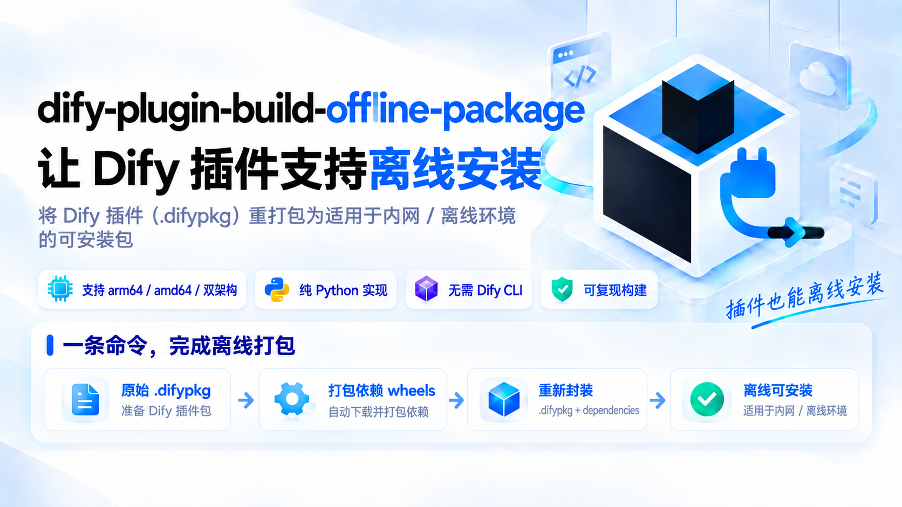

<div align="center">


# dify-plugin-build-offline-package

[](https://www.python.org/)
[](LICENSE)
[](#环境要求与兼容性)
[](https://github.com/zmxccxy/dify-plugin-build-offline-package)
[](https://github.com/zmxccxy/dify-plugin-build-offline-package/releases)
[](https://github.com/zmxccxy/dify-plugin-build-offline-package/commits/main)
[](https://github.com/zmxccxy/dify-plugin-build-offline-package/graphs/contributors)

**简体中文** | [English](README_EN.md)

</div>

<p align="center">
  
</p>

## 解决什么问题

Dify 安装插件时，插件守护进程（`plugin_daemon`）会为插件创建独立的 Python 虚拟环境，
用 `uv pip install` / `uv sync` 从 PyPI **联网**安装依赖。内网服务器（离线 / 涉密 / 政企 /
实验室环境）装插件因此必然失败。

**dify-plugin-build-offline-package** 把任意现成的插件 `.difypkg` 重打包为**自包含离线包**：所有依赖
wheel 内置进包内，守护进程全部从本地文件安装——**安装时完全不需要联网**。

诞生于真实场景：把官方 `openai_api_compatible` 插件装到 ARM64 内网 Dify 1.17.0 服务器。

## 快速开始

原始 `.difypkg` 放 `build.py` 同目录即可自动识别，也可用 `--input /path/to/xx.difypkg` 指定任意路径。

打包命令（macOS / Linux 用 `python3`，Windows 用 `python`，加 `--pip-source` 换国内源）：

```bash
python3 build.py
python3 build.py --arch amd64 --pip-source tsinghua
```

产物为 `build.py` 同目录下的两个文件：

```
openai_api_compatible-0.0.65-arm64-offline.difypkg
openai_api_compatible-0.0.65-arm64-offline.difypkg.sha256
```

装到内网服务器前，先看[内网服务器安装注意](#内网服务器安装注意)（签名校验 / 包大小 / nginx 限制）。

## 参数

```
python3 build.py [options]
```

| 参数 | 取值 | 说明 |
| ---- | ---- | ---- |
| `--input` | 路径 | 原始 `.difypkg`（缺省自动识别同目录下非 `-offline` 的包） |
| `--arch` | `arm64` / `amd64` / `both` | 目标架构（默认 arm64；both 双架构一个包，体积约 1.6 倍） |
| `--pip-source` | `official` / `aliyun` / `tsinghua` / `tencent` / `ustc` | wheel 下载源（默认官方） |
| `--pip-index-url` | URL | 自定义源，优先于 `--pip-source` |
| `--python-version` | 如 `3.12` | 覆盖 wheel 的 Python 版本（默认读 manifest） |
| `--retries` | 整数 | 每个下载动作重试次数（默认 3） |
| `--no-verify` | — | 跳过 uv 离线校验 |
| `--log-file` | 路径 | 日志文件（默认脚本同目录 `build.log`） |
| `--verbose` | — | 控制台调试级输出（日志文件始终全量记录） |

产物命名：`openai_api_compatible-0.0.65-arm64.difypkg` →
`openai_api_compatible-0.0.65-arm64-offline.difypkg`（`--arch both` → `-all-arch-offline`）。

## 获取原始 .difypkg

1. 从**官方市场 / GitHub Releases** 获取所需插件的发布包——推荐，一定包含 `requirements.txt`；
2. 用官方 CLI 从源码打包：`dify plugin package <目录> -o out.difypkg`
   —— CLI 安装方式见 [Dify Plugin CLI](https://docs.dify.ai/en/develop-plugin/getting-started/cli)
   （二进制下载：[dify-plugin-daemon Releases](https://github.com/langgenius/dify-plugin-daemon/releases)）；
3. 从已有的 Dify 实例导出。

> 本工具只负责重打包；如需从源码打包，请先用官方 CLI。

## pip 源

| 名称 | 地址 |
| ---- | ---- |
| `official` | `https://pypi.org/simple` |
| `aliyun` | `https://mirrors.aliyun.com/pypi/simple/` |
| `tsinghua` | `https://pypi.tuna.tsinghua.edu.cn/simple` |
| `tencent` | `https://mirrors.cloud.tencent.com/pypi/simple` |
| `ustc` | `https://pypi.mirrors.ustc.edu.cn/simple/` |

镜像偶尔会比官方源晚同步几小时到几天（新发布的版本可能暂时缺失），某个依赖下载失败时换源即可：

```bash
python3 build.py --pip-source aliyun
# 或使用内部镜像：
python3 build.py --pip-index-url http://nexus.internal/pypi/simple
```

## 工作原理

```
原始 .difypkg
      │ 1. 解压
      ▼

插件源码 + requirements.txt + pyproject.toml + uv.lock
      │ 2. pip download（按目标架构 arm64 / amd64，manylinux2014 + manylinux_2_28，
      │     Python 版本取自 manifest.yaml 的 meta.runner.version）
      ▼

deps/*.whl
      │ 3. 重写 requirements.txt → ./deps/xxx.whl（--arch both 时按 platform_machine 标记）
      │ 4. 删除 pyproject.toml / uv.lock → 强制守护进程走 requirements.txt 本地安装路径
      │ 5. 重新打包（固定时间戳，产物字节级可复现）
      ▼

<原名>-<arch>-offline.difypkg
      │ 6. 可选校验（装有 uv 时执行）
      ▼

uv pip install --dry-run --offline -r requirements.txt   ← 与守护进程安装命令完全一致
```

> 为什么删 `pyproject.toml`？包里有它时守护进程优先执行 `uv sync --frozen`（联网解析）。
> 删掉它（和 `uv.lock`）后守护进程只能走 `requirements.txt`，即本地 wheel 离线安装。

## 特性

- 🌍 跨平台：仅用 Python 3 标准库 + pip，macOS / Windows / Linux 一致运行
- 🏗️ 多架构：`arm64`、`amd64`，或 `both` 双架构合一（安装时按 `platform_machine` 自动选 wheel）
- 🪞 pip 源可配：官方 / 阿里 / 清华 / 腾讯 / 中科大，或任意自定义源（内部 Nexus 等）
- 📋 失败处理：先整包下载，失败自动转逐包重试；每个失败依赖单独记日志，退出码 1，
  绝不产出半成品包
- 📝 全流程日志：控制台 + `build.log`，带时间戳，每次重试都记录
- ✅ 自动校验：装有 uv 时用守护进程同款命令 `uv pip install --dry-run --offline` 验证
- 🔏 可复现：固定 zip 时间戳，重复打包 SHA256 一致
- 🚫 不需要 Dify CLI：重打包只需 zip 操作 + pip download（仅"自签名"才需要 CLI）

## 环境要求与兼容性

### 环境要求

| 项目 | 要求 |
| ---- | ---- |
| Python | 3.8+ 且带 `pip`（wheel 由该 pip 下载） |
| 网络 | 打包机需能访问所选 pip 源 |
| 输入包 | 有效的 Dify 插件 `.difypkg`，**且包含 `requirements.txt`**（官方市场 / GitHub Releases 的包都满足） |
| 可选 | `uv`（用于离线解析验证，`pip install uv`） |

### 操作系统兼容性

脚本只依赖 Python 标准库 + pip（无 shell 命令、无平台相关路径），三大桌面系统均可运行：

| 系统 | 状态 |
| ---- | ---- |
| macOS (arm64) | ✅ 已实测——完整流程，arm64 与双架构构建 |
| Linux (amd64) | ✅ 已实测——Debian 容器内完整流程，含 uv 离线验证 |
| Linux (arm64) | ✅ 与上述实测构建同一代码路径 |
| Windows | ✅ 设计兼容（纯标准库、UTF-8 控制台处理、路径分隔符处理）；欢迎实机验证，有问题提 issue |

Windows 下调用：`python build.py ...`（或 `py -3 ...`）。

### Dify 版本兼容性

> ⚠️ **版本声明**：本项目目前已在 **Dify 1.17.0**（plugin-daemon 0.6.x）上验证，其他 Dify 版本**不保证兼容**。

## 日志与失败处理

- 先整包下载（快）；失败后自动转入逐包下载，已下载的部分自动复用、不会重复下载；
- 每个依赖有独立的重试和日志行：

```
2026-09-06 18:14:51 [INFO] [3/43] gevent==26.5.0 —— 第 1/3 次下载尝试
2026-09-06 18:14:53 [WARNING] [3/43] gevent==26.5.0 —— 失败(exit=1): ERROR: No matching distribution ...
2026-09-06 18:15:02 [ERROR] 依赖下载失败: gevent==26.5.0
...
2026-09-06 18:15:02 [ERROR] 存在下载失败的依赖（43 条），详见上方 [ERROR] 日志: build.log
```

- 失败时退出码为 **1**，且不产出任何包。

## 校验

装有 `uv` 时，脚本会执行**守护进程同款安装命令**做离线解析验证：

```
uv pip install --dry-run --offline --target <tmp> \
    --python-platform aarch64-unknown-linux-gnu --python-version 3.12 \
    -r requirements.txt
```

出现 `离线解析验证通过` 即代表该包可以在服务器上纯离线安装。

## 内网服务器安装注意

### 签名校验：两种放行方式

重打包会改变包内容，官方签名必然失效，安装时报
`plugin verification has been enabled ... bad signature`。**二选一**：

| 方式 | 安全性 | 需要 Dify CLI | 适用场景 |
| ---- | ------ | ------------- | -------- |
| **A. 关闭签名校验** | 较低 | 否 | 图省事、内网可控 |
| **B. 第三方签名验证** | 高 | **是** | 保留校验，只额外信任自己的密钥 |

#### 方式 A：关闭签名校验

在 Dify 部署的 `.env` 中设置，然后重启守护进程：

```bash
FORCE_VERIFYING_SIGNATURE=false
docker compose up -d plugin_daemon
```

此方式会**跳过所有签名校验**，官方市场插件与你自制的包都不再验证，请自行评估风险。

#### 方式 B：第三方签名验证（推荐）

保留签名校验，在白名单中**追加**自己的公钥 —— 官方公钥始终有效，因此
**官方市场插件照常可用**，只是额外信任你签名的包。

> ⚠️ **需要官方 Dify CLI**：本工具不生成签名，自签名须由 `dify signature` 完成。
> 安装 CLI：`brew install langgenius/dify/dify`（Linux / Windows 见
> [dify-plugin-daemon Releases](https://github.com/langgenius/dify-plugin-daemon/releases)）。
> 若不愿引入 CLI，请改用方式 A。

```bash
# 1) 生成密钥对（私钥务必保密）
dify signature generate -f mykey

# 2) 签名离线包（本工具产物内已无旧签名文件，可直接签）
dify signature sign xxx-arm64-offline.difypkg -p mykey.private.pem -c langgenius

# 3) 校验
dify signature verify xxx-arm64-offline.signed.difypkg -p mykey.public.pem
```

把公钥交给守护进程，并在 `docker-compose.override.yaml` 中启用：

```yaml
services:
  plugin_daemon:
    environment:
      FORCE_VERIFYING_SIGNATURE: true
      THIRD_PARTY_SIGNATURE_VERIFICATION_ENABLED: true
      THIRD_PARTY_SIGNATURE_VERIFICATION_PUBLIC_KEYS: /app/storage/public_keys/mykey.public.pem
```

需先把公钥放到挂载目录（`plugin_daemon` 的 `./volumes/plugin_daemon` 挂到容器内 `/app/storage`）：

```bash
mkdir -p docker/volumes/plugin_daemon/public_keys
cp mykey.public.pem docker/volumes/plugin_daemon/public_keys/
docker compose up -d plugin_daemon
```

关于 `-c` 的取值：合法值只有 `langgenius` / `partner` / `community`，它表示
「被授权以何名义分发」。若插件 `manifest.yaml` 的 `author` 为 `langgenius`，则**必须**
用 `-c langgenius`，否则报 `unauthorized langgenius plugin`；`author` 为其它的用
`-c community`。

### 包大小限制

Dify 1.17.0 的 api 容器默认 `PLUGIN_MAX_PACKAGE_SIZE=52428800`（50MB），
单架构包一般够用；双架构包超限时调大该值。

### 前置 nginx

上传报 `413 Request Entity Too Large` 时，把对应 nginx 的
`client_max_body_size` 调到大于包体积后 reload。

## FAQ

- **为什么用 manylinux2014 + manylinux_2_28 两个标签？** 部分新包（如 gevent 新版）只发
  `manylinux_2_28` wheel；官方守护进程镜像为 Ubuntu 24.04（glibc 2.39），两者都兼容。
- **需要装官方 Dify CLI 吗？** 打包不需要，只有"从源码打包原始包"和"自签名"才需要它。
  不装 CLI 也能用，此时内网侧改用[关闭签名校验](#内网服务器安装注意)放行（见安装注意）。
- **重复打包 SHA256 一样吗？** 一样（固定时间戳 + 排序，同内容同字节）。
- **both 包体积翻倍吗？** 仅二进制 wheel 双份（按 `platform_machine` 标记），纯 Python
  wheel 只存一份；典型模型供应商插件从 ~13MB（单架构）到 ~21MB（双架构）。
- **能用公司内部镜像吗？** `--pip-index-url http://<镜像>/pypi/simple`。

## 项目结构

```
.
├── build.py                      # 打包工具（纯 Python 3 标准库）
├── images/                       # logo / 海报素材
│   ├── logo.svg
│   └── poster-cn.png · poster-en.png
├── 离线包打包文档.md               # 中文详细文档
├── build.log                     # 运行日志（每次运行追加）
├── README.md                     # 中文说明（本文件）
├── README_EN.md                  # English README
└── LICENSE
```

## 声明

本项目为社区工具，**与 langgenius / Dify 官方无关**；"Dify" 等商标归其所有者所有。
README 的排版与徽章风格参考了 [Dify 官方仓库](https://github.com/langgenius/dify)，致谢 Dify 团队。

## Star 增长趋势

<a href="https://star-history.com/#zmxccxy/dify-plugin-build-offline-package&date">
  <picture>
    <source media="(prefers-color-scheme: dark)" srcset="https://api.star-history.com/svg?repos=zmxccxy/dify-plugin-build-offline-package&type=Date&theme=dark" />
    <source media="(prefers-color-scheme: light)" srcset="https://api.star-history.com/svg?repos=zmxccxy/dify-plugin-build-offline-package&type=Date" />
    
  </picture>
</a>

## 许可证

[MIT](LICENSE)
