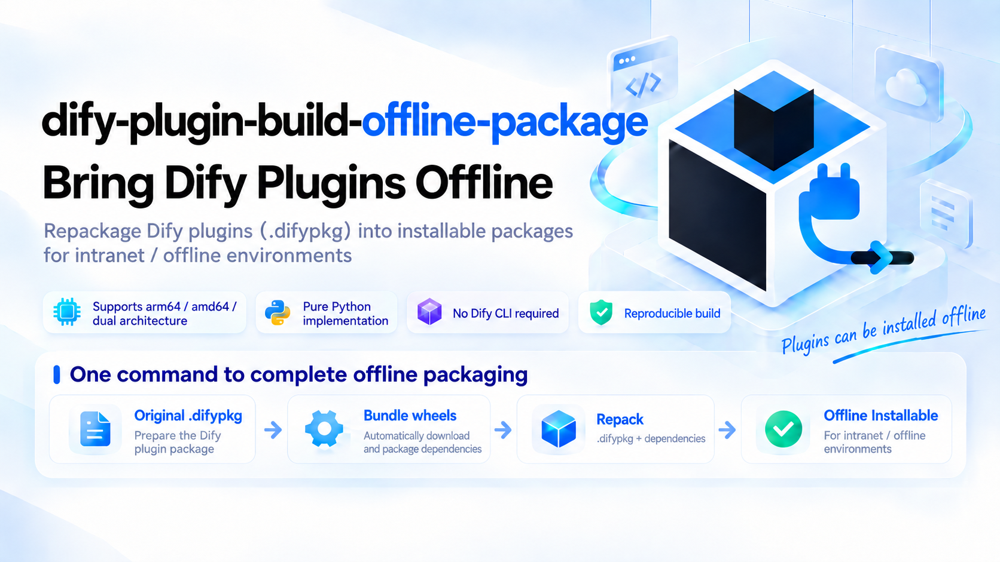
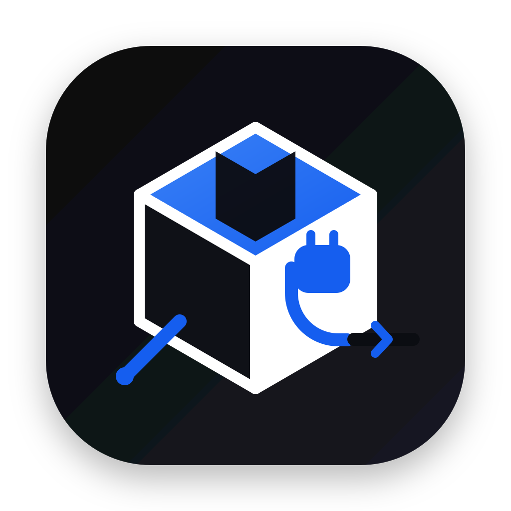

<div align="center">





# dify-plugin-build-offline-package

[](https://www.python.org/)
[](LICENSE)
[](#8-requirements--compatibility)
[](https://github.com/zmxccxy/dify-plugin-build-offline-package)
[](https://github.com/zmxccxy/dify-plugin-build-offline-package/releases)
[](https://github.com/zmxccxy/dify-plugin-build-offline-package/commits/main)
[](https://github.com/zmxccxy/dify-plugin-build-offline-package/graphs/contributors)

[简体中文](README.md) | **English**

</div>

## 1. What problem does it solve

Dify installs a plugin by having its plugin daemon (`plugin_daemon`) create a fresh Python
virtual environment and install the plugin's dependencies with `uv pip install` /
`uv sync` — which **requires network access to PyPI**. On intranet servers (air-gapped,
government, enterprise, or lab environments) plugin installation therefore fails.

**dify-plugin-build-offline-package** turns any existing plugin `.difypkg` into a **self-contained offline
package**: every dependency wheel is bundled inside the package, and the daemon installs
everything from local files — **no network needed at install time**.

Born from a real-world case: installing the official `openai_api_compatible` plugin on an
ARM64 intranet Dify 1.17.0 server.

## 2. Quick start

The original `.difypkg` is auto-detected next to `build.py`, or point to any path with `--input /path/to/xx.difypkg`.

Build (use `python3` on macOS / Linux, `python` on Windows; add `--pip-source` for a faster mirror):

```bash
python3 build.py
python3 build.py --arch amd64 --pip-source tsinghua
```

Two files are produced next to `build.py`:

```
openai_api_compatible-0.0.65-arm64-offline.difypkg
openai_api_compatible-0.0.65-arm64-offline.difypkg.sha256
```

Before installing on the offline server, read
[内网服务器安装注意](README.md#内网服务器安装注意)
(signature verification / package size / nginx limits).

## 3. Usage

```
python3 build.py [options]
```

| Option | Values | Description |
| ------ | ------ | ----------- |
| `--input` | path | Original `.difypkg` (default: auto-detect a non-`-offline` `.difypkg` in the script directory) |
| `--arch` | `arm64` / `amd64` / `both` | Target server architecture (default `arm64`). `both` = one universal package, roughly double the size |
| `--pip-source` | `official` / `aliyun` / `tsinghua` / `tencent` / `ustc` | PyPI index for downloading wheels (default `official`) |
| `--pip-index-url` | URL | Custom index (takes priority over `--pip-source`, e.g. internal Nexus/Artifactory) |
| `--python-version` | e.g. `3.12` | Python version of the wheels (default: `meta.runner.version` from `manifest.yaml`, fallback 3.12) |
| `--retries` | int | Retries per download action (default 3) |
| `--no-verify` | — | Skip the `uv` offline-resolution verification |
| `--log-file` | path | Log file (default `build.log` next to the script) |
| `--verbose` | — | Debug-level console output (the log file always records everything) |

Output naming: `openai_api_compatible-0.0.65-arm64.difypkg` →
`openai_api_compatible-0.0.65-arm64-offline.difypkg` (`--arch both` → `-all-arch-offline`).

## 4. Getting an original `.difypkg`

1. **Official marketplace / GitHub release** of the plugin you need — recommended, it always
   contains `requirements.txt`;
2. **Build from source** with the official CLI: `dify plugin package <dir> -o out.difypkg`
   — CLI install instructions: [Dify Plugin CLI](https://docs.dify.ai/en/develop-plugin/getting-started/cli)
   (binaries: [dify-plugin-daemon Releases](https://github.com/langgenius/dify-plugin-daemon/releases));
3. Export from an existing Dify instance.

> This tool only repackages. If you must build from source, use the official CLI first.

## 5. pip mirrors

| Name | URL |
| ---- | --- |
| `official` | `https://pypi.org/simple` |
| `aliyun` | `https://mirrors.aliyun.com/pypi/simple/` |
| `tsinghua` | `https://pypi.tuna.tsinghua.edu.cn/simple` |
| `tencent` | `https://mirrors.cloud.tencent.com/pypi/simple` |
| `ustc` | `https://pypi.mirrors.ustc.edu.cn/simple/` |

Mirrors occasionally lag behind PyPI for a few hours/days (e.g. a brand-new package version
may be missing) — if a dependency fails, simply switch sources:

```bash
python3 build.py --pip-source aliyun
# or an internal mirror:
python3 build.py --pip-index-url http://nexus.internal/pypi/simple
```

## 6. How it works

```
original .difypkg
      │ 1. unzip
      ▼

plugin source + requirements.txt + pyproject.toml + uv.lock
      │ 2. pip download (per target arch: arm64 / amd64, manylinux2014 + manylinux_2_28,
      │     Python version read from manifest.yaml → meta.runner.version)
      ▼

deps/*.whl
      │ 3. rewrite requirements.txt  →  ./deps/xxx.whl
      │     (--arch both adds platform_machine markers)
      │ 4. remove pyproject.toml & uv.lock
      │     → forces the daemon onto the requirements.txt (local) path
      │ 5. re-zip (deterministic, fixed timestamps)
      ▼

<name>-<arch>-offline.difypkg
      │ 6. optional verification (when uv is available)
      ▼

uv pip install --dry-run --offline -r requirements.txt   ← same command the daemon uses
```

> Why remove `pyproject.toml`? When a plugin package contains `pyproject.toml`, the daemon
> prefers `uv sync --frozen`, which resolves from the network. Removing it (and `uv.lock`)
> forces the daemon to install from the bundled `requirements.txt` — fully offline.

## 7. Features

- 🌍 **Cross-platform**: pure Python 3 stdlib + `pip`; runs identically on macOS, Windows and Linux
- 🏗️ **Multi-arch**: `arm64`, `amd64`, or `both` (one universal package, wheel selected at
  install time via `platform_machine` markers)
- 🪞 **Configurable pip sources**: official PyPI, Aliyun, Tsinghua, Tencent, USTC, or any
  custom index (e.g. an internal Nexus/Artifactory)
- 📋 **Robust failure handling**: whole-file download first, then automatic per-package
  retry; every failed dependency is logged individually, the run ends with exit code 1 and
  never produces a half-baked package
- 📝 **Full logging**: console + `build.log`, timestamped, every retry recorded
- ✅ **Built-in verification**: replicates the daemon's exact install command with
  `uv pip install --dry-run --offline` when `uv` is available
- 🔏 **Reproducible**: fixed zip timestamps → identical SHA256 on re-runs
- 🚫 **No Dify CLI required**: the tool repackages an *existing* `.difypkg` (pure zip
  manipulation + `pip download`); only *self-signing* needs the CLI

## 8. Requirements & Compatibility

### 8.1. Requirements

| Item | Requirement |
| ---- | ----------- |
| Python | 3.8+ with `pip` (the wheels are downloaded by that same pip) |
| Network | the build machine must reach the chosen pip index |
| Input | a valid Dify plugin `.difypkg` that **contains `requirements.txt`** (official marketplace / GitHub release packages all do) |
| Optional | `uv` for the offline-resolution verification step (`pip install uv`) |

### 8.2. OS compatibility

The tool uses only the Python standard library plus `pip`, with no shell commands or
OS-specific paths, and runs on all major desktop OSes:

| OS | Status |
| -- | ------ |
| macOS (arm64) | ✅ tested — full flow, arm64 & both-arch builds |
| Linux (amd64) | ✅ tested — full flow in a Debian container, incl. `uv --offline` verification |
| Linux (arm64) | ✅ same code path as the tested builds above |
| Windows | ✅ compatible by design (stdlib only, UTF-8 console handling, `\`/`/` path handling); machine-testing welcome — please open an issue if anything breaks |

Windows invocation: `python build.py ...` (or `py -3 ...`).

### 8.3. Dify version compatibility

> ⚠️ **Version notice**: currently validated against **Dify 1.17.0** (plugin-daemon 0.6.x); other Dify versions are **not guaranteed** to be compatible.

## 9. Logging & failure handling

- Whole-file download first (fast); on failure it automatically switches to per-package
  downloads, reusing everything already downloaded;
- Each dependency gets its own retries and its own log line:

```
2026-09-06 18:14:51 [INFO] [3/43] gevent==26.5.0 —— 第 1/3 次下载尝试
2026-09-06 18:14:53 [WARNING] [3/43] gevent==26.5.0 —— 失败(exit=1): ERROR: No matching distribution ...
2026-09-06 18:15:02 [ERROR] 依赖下载失败: gevent==26.5.0
...
2026-09-06 18:15:02 [ERROR] 存在下载失败的依赖（43 条），详见上方 [ERROR] 日志: build.log
```

- Failed runs exit with code **1** and produce no output package.

## 10. Verification

When `uv` is installed, the script runs the **exact install command the Dify daemon uses**:

```
uv pip install --dry-run --offline --target <tmp> \
    --python-platform aarch64-unknown-linux-gnu --python-version 3.12 \
    -r requirements.txt
```

`离线解析验证通过` means the package can install on the server with zero network.

## 11. Installing on the offline server

### 11.1. Signature verification: two ways to allow the package

Repackaging changes the package contents, so the official signature is always invalidated and
installation fails with `plugin verification has been enabled ... bad signature`. Pick **one**:

| Option | Security | Needs Dify CLI | When to use |
| ------ | -------- | -------------- | ----------- |
| **A. Disable verification** | Lower | No | Quick and simple, trusted intranet |
| **B. Third-party verification** | Higher | **Yes** | Keep verification, trust only your own key |

#### 11.1.1. Option A: disable signature verification

Set this in the Dify deployment `.env`, then restart the daemon:

```bash
FORCE_VERIFYING_SIGNATURE=false
docker compose up -d plugin_daemon
```

This **skips all signature checks** — neither marketplace plugins nor your own are verified.

#### 11.1.2. Option B: third-party signature verification

Verification stays on, and your public key is **appended** to the whitelist. The official key is
always included, so **marketplace plugins keep working** — your signed packages are simply
trusted in addition.

> ⚠️ **Requires the official Dify CLI.** This tool does not generate signatures; self-signing is
> done by `dify signature`. Install it with `brew install langgenius/dify/dify` (Linux / Windows:
> [dify-plugin-daemon Releases](https://github.com/langgenius/dify-plugin-daemon/releases)).
> If you'd rather not add the CLI, use Option A instead.

##### 11.1.2.1. Generate a key and sign

```bash
# 1) generate a key pair (keep the private key secret)
dify signature generate -f mykey

# 2) sign the offline package (the tool's output has no stale signature file)
dify signature sign xxx-arm64-offline.difypkg -p mykey.private.pem -c langgenius

# 3) verify
dify signature verify xxx-arm64-offline.signed.difypkg -p mykey.public.pem
```

##### 11.1.2.2. What should `-c` be?

`-c` (`authorized_category`) declares **under whose name the package is distributed**. The daemon
compares it with the `author` field in the plugin's `manifest.yaml`. Only three values are valid:

| `-c` value | Meaning |
| ---------- | ------- |
| `langgenius` | Distributed on behalf of Dify (langgenius) |
| `partner` | Distributed on behalf of an official partner |
| `community` | Distributed by a community developer |

###### 11.1.2.2.1. How to choose

Look only at the plugin's `author` field in `manifest.yaml`:

| Plugin's `author` | Required `-c` | Consequence of getting it wrong |
| ----------------- | ------------- | ------------------------------- |
| `langgenius` | `-c langgenius` | Daemon refuses to install: `unauthorized langgenius plugin` |
| Anything else (e.g. `yourname`) | `-c community` | Normally no impact on installation |

The rule: **if the plugin claims to be official, you must sign with `langgenius`; otherwise use
`community`.** This comes from the daemon's `isUnauthorizedLanggenius()` — an `author` of
`langgenius` without a `langgenius`-category signature is treated as impersonating the official
identity.

For example, this repo's test plugin `langgenius-deepseek` has `author: langgenius`, so:

```bash
grep '^author:' manifest.yaml     # check first; prints author: langgenius
dify signature sign xxx.difypkg -p mykey.private.pem -c langgenius
```

##### 11.1.2.3. Hand the public key to the daemon

Place it in the mounted directory first (`plugin_daemon`'s `./volumes/plugin_daemon` is mounted at
`/app/storage` inside the container):

```bash
mkdir -p docker/volumes/plugin_daemon/public_keys
cp mykey.public.pem docker/volumes/plugin_daemon/public_keys/
```

Then enable the feature in `docker-compose.override.yaml`:

```yaml
services:
  plugin_daemon:
    environment:
      FORCE_VERIFYING_SIGNATURE: true
      THIRD_PARTY_SIGNATURE_VERIFICATION_ENABLED: true
      THIRD_PARTY_SIGNATURE_VERIFICATION_PUBLIC_KEYS: /app/storage/public_keys/mykey.public.pem
```

```bash
docker compose up -d plugin_daemon
```

### 11.2. Package size limit

Dify 1.17.0's api container defaults to `PLUGIN_MAX_PACKAGE_SIZE=52428800` (50 MB). Fine for
single-arch packages; raise it if a `both` package exceeds it.

### 11.3. Front nginx

`413 Request Entity Too Large` means the nginx in front of Dify needs `client_max_body_size`
greater than the package size, then reload.

## 12. FAQ

**Why `manylinux2014` and `manylinux_2_28`?**
Some packages (e.g. recent gevent releases) only publish `manylinux_2_28` wheels. The
official plugin-daemon image is Ubuntu 24.04 (glibc 2.39), which runs both.

**Do I need the official Dify CLI?**
No for building — repackaging only needs Python's `zipfile` + `pip download`. It is required for
packaging a plugin from source code, and for *self-signing*. Without it, use Option A in
[Installing on the offline server](#11-installing-on-the-offline-server) instead.

**Why is the SHA256 identical on every re-run?**
Zip entries use fixed timestamps and sorted order, so identical content produces identical
bytes — handy for CI and integrity tracking.

**Will `--arch both` double the size?**
Only the binary wheels are duplicated (with `platform_machine` markers); pure-Python wheels
are stored once. A typical model-provider plugin goes from ~13 MB (single arch) to ~21 MB.

**Can I use an internal mirror (Nexus/Artifactory)?**
Yes: `--pip-index-url http://<mirror>/pypi/simple`.

## 13. Project structure

```
.
├── build.py                      # the tool (Python 3 stdlib only)
├── images/                       # logo & poster assets
│   ├── logo.svg
│   └── poster-cn.png · poster-en.png
├── 离线包打包文档.md               # full Chinese documentation
├── build.log         # generated log (appended per run)
├── README.md                     # 中文说明 (Chinese)
├── README_EN.md                  # English README (this file)
└── LICENSE
```

## 14. Disclaimer

This is a community tool, **not affiliated with or endorsed by langgenius / Dify**.
"Dify" and related marks belong to their respective owners. The README layout and badge
style are inspired by the [official Dify repository](https://github.com/langgenius/dify) —
thanks to the Dify team.

## 15. Star history

<a href="https://star-history.com/#zmxccxy/dify-plugin-build-offline-package&date">
  <picture>
    <source media="(prefers-color-scheme: dark)" srcset="https://api.star-history.com/svg?repos=zmxccxy/dify-plugin-build-offline-package&type=Date&theme=dark" />
    <source media="(prefers-color-scheme: light)" srcset="https://api.star-history.com/svg?repos=zmxccxy/dify-plugin-build-offline-package&type=Date" />
    
  </picture>
</a>

## 16. License

[MIT](LICENSE)
